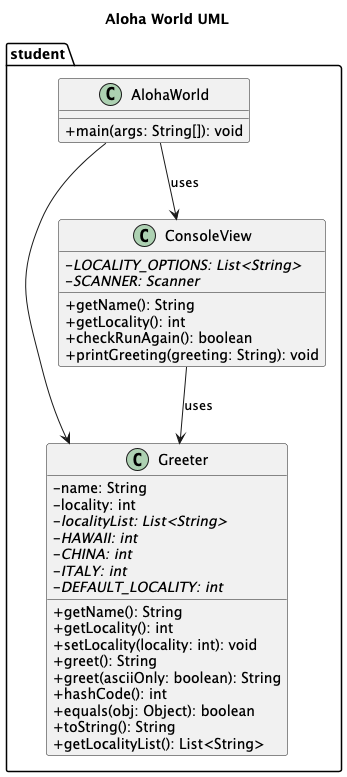

# Homework Aloha World Report

The following report contains questions you need to answer as part of your submission for the homework assignment. 

## Design Doc
Please link your UML design file here. See resources in the assignment on how to
link an image in markdown. You may also use [mermaid] class diagrams if you prefer, if so, include the mermaid code here.  You DO NOT have to include Greeting.java as part of the diagram, just the AlohaWorld application that includes: [AlohaWorld.java], [Greeter.java], and [ConsoleView.java].

### Program Flow
Write a short paragraph detailing the flow of the program in your own words. This is to help you understand / trace the code (and give you practice of something called a code walk that will be required in this course).
   * The program begins in main() in AlohaWorld class which then prompts the user to input their name and locality(invalid input can not be accepted) by calling getName() and getLocality() methods in ConsoleView class. It then creates an instance of Greeter class, passing the name and locality to the constructor. Then it calls the printGreeting() method of ConsoleView class to print the greeting message created by greet method in Greeter class.
   * After printing the greeting, the program enters a loop that continues as long as the users indicate that they want to be greeted again by calling checkRunAgain() method of ConsoleView class. In each iteration, the program asks the user a new locality just like the way getting the primary locality and calls setLocality method of Greeter class to updates the Greeter instance, finally displays the updated greeting following the similar process to the first greeting. The loop repeats until the users indicate that they do not want to be greeted again.

## Assignment Questions

1. List three additional java syntax items you didn't know when reading the code.  (make sure to use * for the list items, see example below, the backtick marks are used to write code inline with markdown)
   
   * (example) `final class`
   * `static`
   * `package`
   * `try` and `catch`

2. For each syntax additional item listed above, explain what it does in your own words and then link a resource where you figured out what it does in the references section. 

    * (example) The `final` keyword when used on a class prevents the class from being subclassed. This means that the class cannot be extended by another class. This is useful when you want to prevent a class from being modified or extended[^1] . It is often the standard to do this when a class only contains static methods such as driver or utility classes. Math in Java is an example of a final class[^2] .
    * The `static` variables are those variables that are common to all objects. They are associated with the class, rather than with any object, meaning that it has the same value for every instance of that class and can be accessed without creating an instance of the class[^3].
    * The`package` is a feature of the Java programming language that help to organize and structure classes and their relationships to one another[^4]. With package, it is easy to know that these types in a `package` are related and the names of types won't conflict with the type with the same names in other `packages` because the `package` creates a new namespace. Note that types refers to classes, interfaces, enumerations, and annotation types[^5].
    * The `try` block is the first step to construct an exception handler and enclose the code that might throw an exception. If an exception occurs within the `try` block, that exception is handled by an exception handler associated with it[^6]. Exception handlers can be associated with a `try` block by providing one or more `catch` blocks directly after the `try` block. The `catch` block contains code that is executed if and when the exception handler happens[^7].
3. What does `main` do in Java?  
    * In the Java programming language, every application must contain a `main` method whose signature is:`public static void main(String[] args)`. It's the entry point for program application and will subsequently invoke all the other methods included in program. The `main` method contains a single argument: an array of elements of type String. This array is the mechanism through which the runtime system passes information to program application[^8].

4. What does `toString()` do in Java? Why should any object class you create have a `toString()` method?

    * In general, the toString method returns a string that "textually represents" this object. The Object's toString() method returns a String representation of the object, which is a concise and informative representation that is easy for people to read and is very useful for debugging[^9].

5. What is javadoc style commenting? What is it used for? 
    * Javadoc-style commenting is a way to document Java code, starting with /** and end with */.[^10]
    * These comments can be recognized by the standard doclet for the javadoc tool, used to generate HTML documentation[^11].

6. Describe Test Driving Development (TDD) in your own words. 

    * TDD means firstly writing code that involves writing an automated unit-level test case that fails and then writing code to make the test pass. And then refactor the production code and test code. Apply the routine to another new test case. With this method, debugging time can be greatly shortened[^12].

7. Go to the [Markdown Playground](MarkdownPlayground.md) and add at least 3 different markdown elements you learned about by reading the markdown resources listed in the document. Additionally you need to add a mermaid class diagram (of your choice does not have to follow the assignment. However, if you did use mermaid for the assignment, you can just copy that there). Add the elements into the markdown file, so that the formatting changes are reserved to that file. 

## Deeper Thinking Questions

These questions require deeper thinking of the topic. We don't expect 100% correct answers, but we encourage you to think deeply and come up with a reasonable answer. 

1. Why would we want to keep interaction with the client contained to ConsoleView?
   *  As client interaction and greeting message generation are two different tasks where the first one is an auxiliary function and the other is the core logic of the program. Separating the two parts apart is a way to ensure every class taking different detailed responsibilities and representing specific similar objects.
      With such arrangement, firstly, it is easier to understand and navigate the code when different responsibilities are handled by specific classes. on the other hand, if we want to change one of them, we just need to modify that part without considering the other parts.
      Secondly, it is easy to debug and find error quickly with such structure.
   *  Also, it makes unit testing easier as we can mock the interaction with users in ConsoleView instead of conducting actual input and output, which is much time-saving and efficient.
      Thirdly, If we want to reuse the core logic in a different context, just reuse the core part of the program without modifying the input/output part.

2. Right now, the application isn't very dynamic in that it can be difficult to add new languages and greetings without modifying the code every time. Just thinking programmatically,  how could you make the application more dynamic? You are free to reference Geeting.java and how that could be used in your design.
   *  We could set an “other” option in getLocality() method in ConsoleView class, when users choose the option, their locality is DEFAULT_LOCALITY. And a method named greetingOtherLanguage(), getGreeting() and getFormat() should be added to ConsoleView class. The parameter in constructor of greeting class should be name, greeting, formatStr. And change the method getFormatStr() to return String.format(this.formatStr, this.greeting).
   *  After the first greeting, call greetingOtherLanguage() method in ConsoleView class, asking the users if they want to be greeted in other language. If the method returns yes, then call getGreeting() method and getFormat() method in ConsoleView class to get the greeting word in other language and greeting format the users prefer. And then creates a new instance of greeting class(greeting(name, greeting, format)), and then execute ConsoleView.printGreeting(String.format(greeting.getFormatStr(), name))).

> [!IMPORTANT]
>  After you upload the files to your github (ideally you have been committing throughout this progress / after you answer every question) - make sure to look at your completed assignment on github/in the browser! You can make sure images are showing up/formatting is correct, etc. The TAs will actually look at your assignment on github, so it is important that it is formatted correctly.

## References

[^1]: Final keyword in Java: 2024. https://www.geeksforgeeks.org/final-keyword-in-java/. Accessed: 2024-03-30. 

[^2]: Math (Java Platform SE 17). https://docs.oracle.com/en/java/javase/17/docs/api/java.base/java/lang/Math.html. Accessed: 2024-03-30.

[^3]: Understanding Class Members. https://docs.oracle.com/javase/tutorial/java/javaOO/classvars.html. Accessed: 2025-01-26.

[^4]: Trail: Learning the Java Language. https://docs.oracle.com/javase/tutorial/java/index.html. Accessed: 2025-01-26.

[^5]: Creating and Using Packages. https://docs.oracle.com/javase/tutorial/java/package/packages.html. Accessed: 2025-01-26.

[^6]: The try Block. https://docs.oracle.com/javase/tutorial/essential/exceptions/try.html. Accessed: 2025-01-26.

[^7]: The catch Blocks. https://docs.oracle.com/javase/tutorial/essential/exceptions/catch.html. Accessed: 2025-01-26

[^8]: Lesson: A Closer Look at the "Hello World!" Application. https://docs.oracle.com/javase/tutorial/getStarted/application/index.html. Accessed: 2025-01-26

[^9]: Class Object. https://docs.oracle.com/javase/8/docs/api/java/lang/Object.html. Accessed: 2025-01-26

[^10]: Javadoc. https://en.wikipedia.org/wiki/Javadoc. Accessed: 2025-01-26

[^11]: Documentation Comment Specification for the Standard Doclet. https://docs.oracle.com/en/java/javase/17/docs/specs/javadoc/doc-comment-spec.html. Accessed: 2025-01-26

[^12]: Test-driven development. https://en.wikipedia.org/wiki/Test-driven_development. Accessed: 2025-01-26
<!-- This is a comment, below this link the links in the document are placed here to make ti easier to read. This is an optional style for markdown, and often as a student you will include the links inline. for example [mermaid](https://mermaid.js.org/intro/syntax-reference.html) -->
[mermaid]: https://mermaid.js.org/intro/syntax-reference.html
[AlohaWorld.java]: src/main/java/student/AlohaWorld.java
[Greeter.java]: src/main/java/student/Greeter.java
[ConsoleView.java]: src/main/java/student/ConsoleView.java